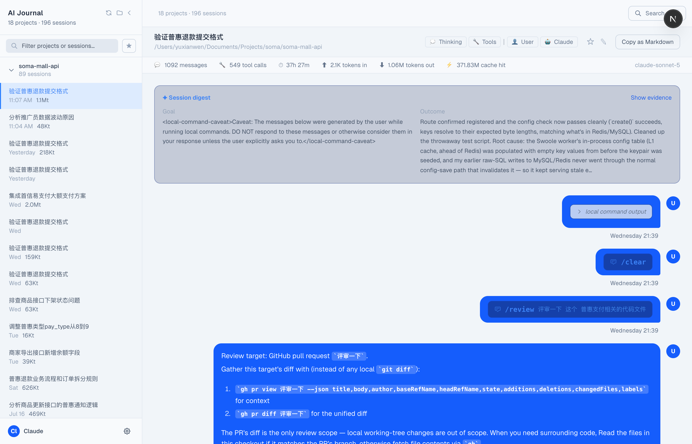
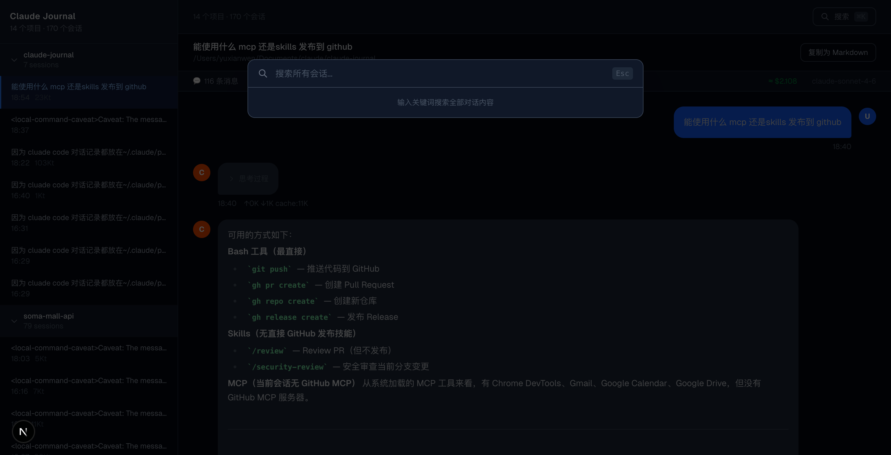

# Claude Journal

Claude Code の会話履歴をローカルで閲覧・確認するための Web アプリです。`~/.claude/projects/` にある JSONL セッションファイルを直接読み込むため、設定不要で使えます。

**言語:** [简体中文](README.zh-CN.md) | [English](README.md) | 日本語 | [한국어](README.ko.md) | [Español](README.es.md) | [Français](README.fr.md) | [Deutsch](README.de.md) | [Português](README.pt.md) | [Русский](README.ru.md) | [العربية](README.ar.md) | [हिन्दी](README.hi.md)



## 機能

- **プロジェクト & セッションブラウザ** — 作業ディレクトリ別にグループ化されたプロジェクトと、サイドバーに表示される全セッション履歴
- **サイドバーフィルター** — キーワードを入力してプロジェクト・セッションをリアルタイム絞り込み、マッチ数も即時更新
- **会話レンダリング** — 完全な Markdown レンダリング、シンタックスハイライト付きコードブロック（Shiki）、GFM テーブル & タスクリスト対応
- **ツール呼び出しの可視化** — Claude が行ったすべてのツール呼び出し（Bash、ファイルの読み書きなど）とその出力を表示
- **思考ブロック** — Claude の推論プロセスを折りたたみ表示
- **トークン統計** — セッションごとの入力 / 出力 / キャッシュヒットのトークン数と推定コスト
- **全文検索** — `⌘K` で全セッションをリアルタイム検索
- **Markdown / 画像エクスポート** — ワンクリックでメッセージを Markdown またはスクリーンショットとしてコピー
- **テーマ切替** — ライト / ダーク / システムテーマ、設定は永続保存
- **11言語対応 UI** — ブラウザのロケールを自動検出、言語ピッカーでいつでも切替可能
- **インライン画像表示** — メッセージに埋め込まれた画像（base64またはURL形式）をその場で表示；クリックで拡大表示
- **画像ライトボックス** — 背景ブラーつきフルスクリーンオーバーレイ；`Esc`または背景クリックで閉じる
- **スラッシュコマンド表示** — `/command`メッセージを生のXMLではなくスタイル付きチップで表示
- **ローカルコマンド出力** — シェルコマンドの出力ブロックをターミナル風UIで表示；詳細な注意メッセージは折りたたみ可能
- **フィルターバーの永続化** — フィルター設定（思考・ツール・ユーザー/Claudeメッセージ）がセッション切替時も維持
- **セッション記憶** — URLパラメータにより、リロード後も最後に閲覧したセッションを復元
- **共有可能URL** — URLをコピーするだけで正確なセッションとスクロール位置を共有（`?p=&s=&scroll=`）
- **トップへ戻る** — 下にスクロールすると浮かびあがるボタン；クリックでページ先頭へ
- **PWA** — デスクトップやホーム画面にインストール可能；新バージョン展開時に自動でサイレント更新



## クイックスタート

**前提条件:** [Claude Code](https://claude.ai/code) がインストール済みで、少なくとも一度使用されていること（`~/.claude/projects/` が存在する状態）。

```bash
# リポジトリをクローン
git clone https://github.com/yuxianwen/claude-journal.git
cd claude-journal

# 依存関係をインストール
pnpm install

# 開発サーバーを起動
pnpm dev
```

[http://localhost:3000](http://localhost:3000) を開くと、すべての Claude Code セッションを閲覧できます。

## 技術スタック

| 技術 | バージョン | 用途 |
|------|-----------|------|
| Next.js | 16 | フレームワーク & API Routes |
| React | 19 | UI |
| Tailwind CSS | v4 | スタイリング |
| Shiki | v4 | コードシンタックスハイライト |
| react-markdown | v10 | Markdown レンダリング |
| remark-gfm | v4 | GFM 拡張構文 |

## データソース

このアプリはローカルファイルのみを読み込みます — ネットワーク通信なし、データのアップロードなし。セッションデータのパス：

```
~/.claude/projects/
  └── <project-id>/
        ├── <session-id>.jsonl
        └── ...
```

各 `.jsonl` ファイルは 1 つの Claude Code セッションに対応しており、完全なメッセージ履歴とトークン使用量が含まれています。

## キーボードショートカット

| ショートカット | 操作 |
|--------------|------|
| `⌘K` | 全文検索を開く |
| `⌘\` | サイドバーの展開 / 折りたたみ |
| `Esc` | 検索 / ライトボックスを閉じる |
